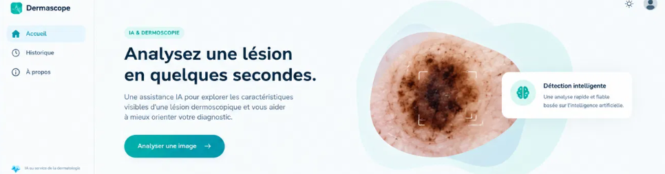
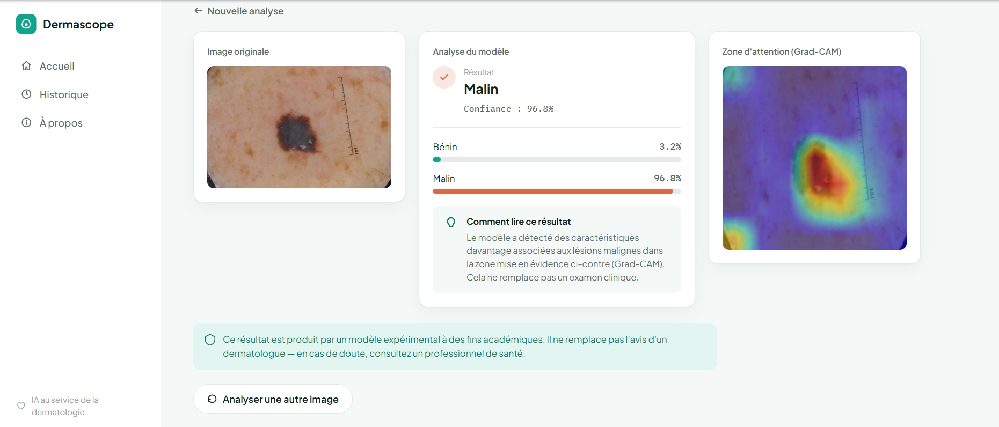

# Dermascope — App Flask de classification de lésions cutanées

Interface web pour déployer le modèle entraîné dans le notebook
`Skin_Lesion_Classification_PFE.ipynb` : upload d'une image, prédiction
benign/malignant, et visualisation Grad-CAM.

## Aperçu

| Accueil | Résultat d'analyse |
|---|---|
|  |  |

## Structure

```
flask_app/
├── app.py                  # backend Flask (modèle + Grad-CAM + API)
├── best_model.pth          # ⚠️ à copier depuis Colab (voir ci-dessous)
├── requirements.txt
├── templates/
│   └── index.html
└── static/
    ├── css/style.css
    └── js/app.js
```

## 1. Récupérer le modèle entraîné

Le fichier `best_model.pth` est généré automatiquement par le notebook
pendant l'entraînement (voir la fonction `train_model`, qui sauvegarde le
meilleur checkpoint). Sur Colab :

```python
from google.colab import files
files.download("best_model.pth")
```

Placez ensuite le fichier téléchargé **à la racine de `flask_app/`** (à côté
de `app.py`).

> Sans ce fichier, l'application démarre quand même mais avec des poids
> aléatoires — utile pour tester l'interface, mais les prédictions n'auront
> aucun sens.

## 2. Installation

```bash
cd flask_app
python -m venv venv
source venv/bin/activate        # Windows : venv\Scripts\activate
pip install -r requirements.txt
```

## 3. Lancer l'application

```bash
python app.py
```

Puis ouvrir **http://127.0.0.1:5000** dans le navigateur.

## Configuration optionnelle (variables d'environnement)

| Variable             | Description                                   | Défaut           |
|----------------------|------------------------------------------------|------------------|
| `CHECKPOINT_PATH`    | Chemin vers le fichier `.pth`                  | `best_model.pth` |
| `DECISION_THRESHOLD` | Seuil de décision sur P(malignant)             | `0.5`            |

Exemple :
```bash
DECISION_THRESHOLD=0.5 CHECKPOINT_PATH=models/resnet50_v2.pth python app.py
```

## Endpoints

- `GET  /`         → interface web
- `POST /predict`  → reçoit un champ `image` (multipart/form-data), renvoie
  un JSON avec la classe prédite, les probabilités, et l'image Grad-CAM
  encodée en base64.
- `GET  /health`   → vérification rapide (device utilisé, checkpoint chargé)

## Aller plus loin

- Déploiement : conteneuriser avec Docker + servir via Gunicorn
  (`gunicorn -w 2 -b 0.0.0.0:8000 app:app`).
- Ajouter une authentification basique si l'app doit être exposée
  publiquement.
- Journaliser les prédictions (sans stocker les images) pour un futur
  monitoring du modèle en production.

## Publier le projet sur GitHub

Le `.gitignore` fourni exclut déjà `best_model.pth` (souvent >90 Mo — au
dessus de la limite standard de 100 Mo par fichier sur GitHub, et de toute
façon un poids entraîné n'a pas sa place dans l'historique Git).

```bash
cd flask_app
git init
git add .
git commit -m "Dermascope — app Flask de classification de lésions cutanées"

# Créez un repo vide sur https://github.com/new, puis :
git remote add origin https://github.com/<votre-utilisateur>/dermascope.git
git branch -M main
git push -u origin main
```

Une fois poussé, la page du repo affichera automatiquement le contenu de ce
`README.md` — y compris les captures d'écran ci-dessus — donc l'interface
sera visible directement sur GitHub, sans que personne ait besoin d'exécuter
le code.


